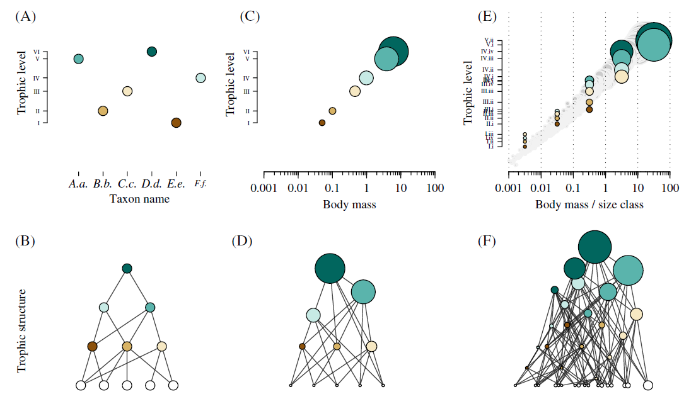
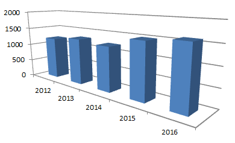
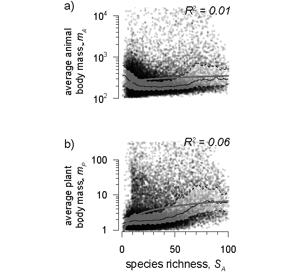
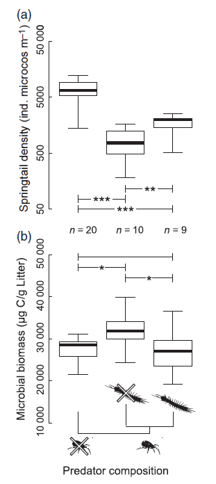
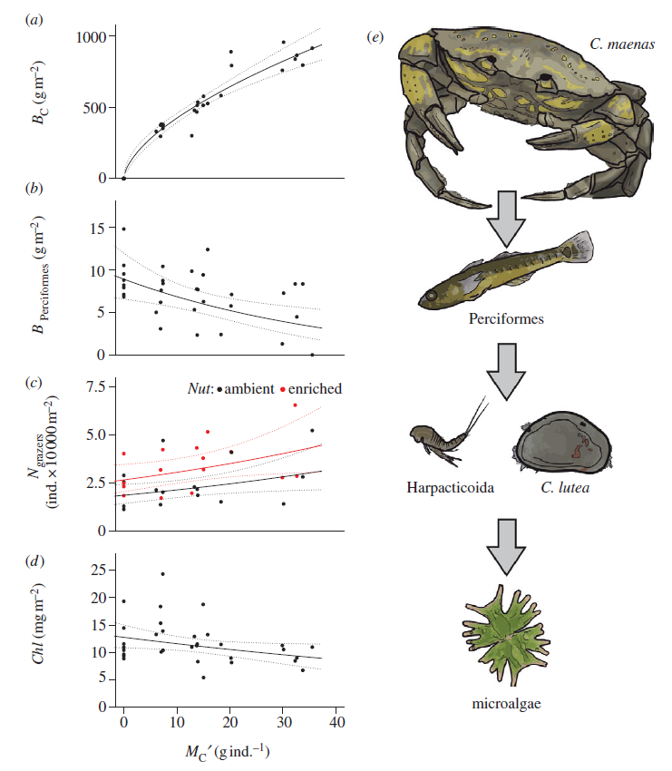
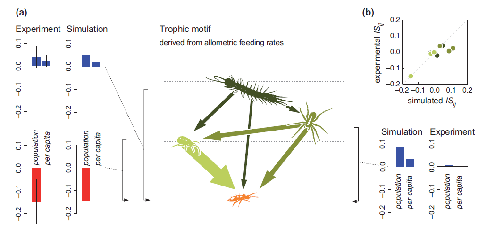
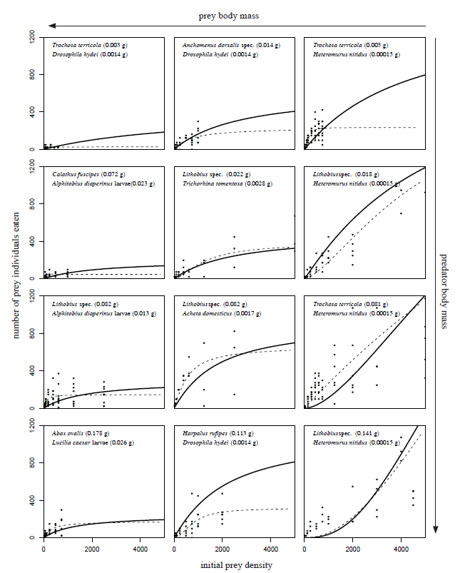
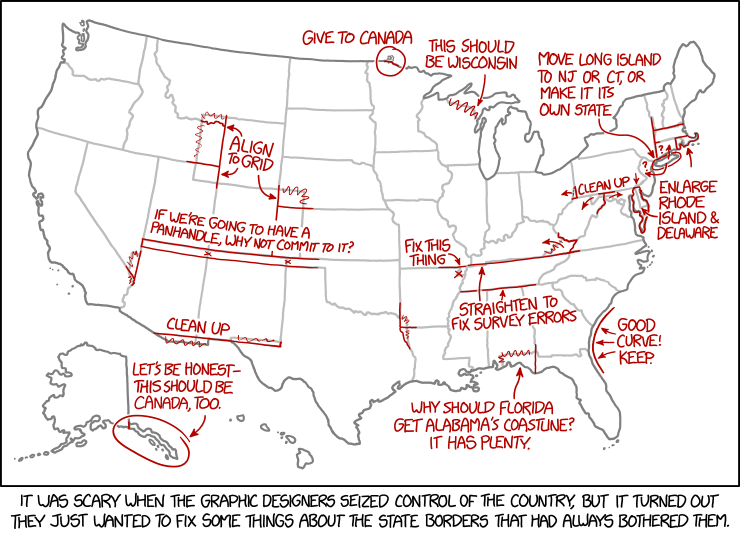

<a rel="license" href="http://creativecommons.org/licenses/by/4.0/"></a><br /><span xmlns:dct="http://purl.org/dc/terms/" href="http://purl.org/dc/dcmitype/Text" property="dct:title" rel="dct:type">Visual Communication: deliver information content in R</span> by <span xmlns:cc="http://creativecommons.org/ns#" property="cc:attributionName">Florian D. Schneider</span> is licensed under a <a rel="license" href="http://creativecommons.org/licenses/by/4.0/">Creative Commons Attribution 4.0 International License</a>.

This presentation discusses concepts for visual communication in general, illustrated by examples using R, and in some cases applying post-processing in Adobe inDesign. 


```{r, echo = FALSE}
rawdata <- read.csv("rawdata.csv")  
plots <- read.csv("plots.csv")  

d0 <- subset(rawdata, notes == "")
plots2013 <- subset(plots, year == "2013")
d0 <- cbind(d0, plots2013[match(d0$plot, plots2013$plot), -c(1,2)])

 f <- as.factor(c("A", "A", "B", "C", "A", "B", "B", "C", "C"))
 m <- matrix(sample(1:25,25), nrow = 5)
 d <- data.frame(x = f, y = c(1,1,1.4,1.2,1.3,1.2,1.4,1.2,1.1))
 l <- list(sample = f, covars = d, mat = m)
 model <- lm(d$y ~ d$x)
 b <- TRUE

x <- y <- seq(0,1,length = 25)
dd0 <- expand.grid(data.frame(x,y))
dd0$z <- with(dd0, 0.1 + 0.4*x - 1.5*x^2 + 1.15*x^3 + 0.2*y - 0.4*y^2 + 0.3*y^3 + 0.2*x*y - 0.23 *x^2*y^2 + 0.33 *x^3*y^3)


```

---

# Visual communication

*Visual*: 

- input interface is the eye of the recipient
- medium is print or screen

*Communication*: 

- sender side intentions: deliver data content; illustrate idea, complex concept; educate
- recipient side condition: context of current knowledge & conditions on exposure; conventions and expectations

Graphics often not standalone, but accompanying text. 

## Properties of scientific visualisations

In the first place, we show data. Visuals are adding high-resolution and detail, were text can only transport summary and statistics. 

Advantages of graphics: 

- high data density
- transport spatial context (maps!)

**Example:** besides the spatial context, maps contain information about area, shape, and neighborhood of a data point. It is easy to read where values are high or low because of spatial context and where and at which level to look for explanatory variables. 


*(Source: E.R. Tufte "The Visual Display of Quantitative Information")*

- increasing objectivity

**Example:**  Anscombes famous quartet of x-y datasets. Each dataset has exactly the same stats regarding means, coefficient of correlation, model fit etc., but visually, they tell a totally different story. 

```{r, echo = FALSE, height = 8, width = 8}

par(mfrow = c(2,2), mar = c(4,4,1,1), las = 1, bty = "n")
for(i in 1:4) {
  model <- lm(anscombe[,c(4)+i] ~ anscombe[,c(0)+i])
  
  plot(anscombe[,c(0,4)+i], xlim = c(0,20), ylim = c(0,20), pch = 20)
  abline(model)
  
  mtext(paste("R²=", round(summary(model)[]$r.squared, 2)), 3, -1, at = 0, adj = 0, cex = 0.7)
  mtext(paste("res. sum of squares =", round( sum(summary(model)[]$residuals^2), 1)), 3, -2, at = 0, adj = 0, cex = 0.7)
  mtext(paste("coeff.cor. =", round( cor(anscombe[,c(0)+i], anscombe[,c(4)+i]), 2)), 3, -3, at = 0, adj = 0, cex = 0.7)
}
```

## A word on tools 

Many R packages available, particularly ggplot2, facilitate plotting into somewhat publishable figures. Just like other software, like Excel or SASS, they come with the risk of ridding oneself of the responsability of thinking about plot elements. Indeed, one intention of those software packages is creating an own style that readers would recognise and make them use their software. 

I am using base R for my examples because I believe, first comes understanding at the low level of plotting grammar, before we can start using powerful tools.

Learn design principles! Not usage of tools. 

## Challenges 

In this document, I want to discuss four big challenges of visual communication in Data Science:

1. Reduce noise
2. Be truthful
3. Build a narrative


---


# 1. Reduce Noise

Noise in graphics are distortions, distractions, anything that puts obstacles in the way of the observer. 

In descriptive statistics and modeling, researchers know the principle of Occam's razor: To describe a thing, use as few elements as possible and as many as necessary. 


## Detail too high?

It is rarely the case that a graph shows too many data. If a graph appears cluttered, this is mostly because it contains to many elements of data or uses a noisy design.
The message delivered from a blurry, dense cloud of data points is also that a large amount of data was available to draw this conclussion. Another message might be the huge complexity of the analysed system (e.g. networks). Thus, reducing data density is not a good choice. 

A bad **Example:** 

```{r, warning = FALSE, echo = FALSE}
library(ggplot2)
 ggplot(diamonds, aes(x=carat, y=price, color=cut)) +
     geom_point()
```

With the choice of color and plot style, it is difficult to extract any information about the size and price of diamonds, depending on their quality. 


A good **Example**: combine summary and raw-data when showing richess in data (panel E) or illustrate network complexity by density of lines.  



*(Source: Brose et al. 2016 Biological Reviews)*

## Chartjunk

Reduce elements of graphs that do not contribute information. 

In this graph, the entire legend and filling is redundant with the x-axis labels. The number of observations could be placed on top of the bars.


*(Source: E.R. Tufte "The Visual Display of Quantitative Information")*

Improved version: 

```{r, fig.width = 5, fig.height = 5, echo = FALSE}
d5 <- data.frame(content = c("Inflation", "Unemployment", "Shortages", "Race", "Crime", "Govt.Power", "Confidence", "Watergate", "Competence" ),
                 critical = c(27,12,15,24,29,42,52,49,29),
                 n = c(415, 100, 68, 103, 123,154,266,537,322)
  )

barplot(d5$critical,  cex.names = 0.6, 
        space = 0, col = "black", border = "white",
        las = 1, yaxp = c(0,60,3))

text(cex=0.8, x=1:9-.5, y=-3.25, d5$content, xpd=TRUE, srt=45, adj = 1)
text(cex = 0.6,  x=1:9-.5, y = d5$critical+5, xpd=TRUE, paste("n =", d5$n))

```


---

## R applications


### background and plot area

```{r}

set.seed(17)

x <- rnorm(150, 2.2, 0.4)
y <- c(11 + 1.4 * x + rnorm(150, 0, 0.1))

d1 <- data.frame(
  x = x,
  y = y
)


x <- rnorm(20, 2.2, 0.4)
y <- c(11 + 1.4 * x + rnorm(20, 0, 0.6))

d2 <- data.frame(
  x = x,
  y = y
)


# figure with strong grid
par( mar = c(4,4,2,1), oma = c(0,0,1,0))
par(las = 1, bty  = "o" , pch = 20)
plot(d1, ylim = c(11,16), yaxs = "i", yaxp = c(12,16,4),
     xlim = c(1,3.25),  xaxs = "i", xaxp = c(1,3,2))
abline(h = seq(10,16,0.5), col = "grey" )
abline(h = seq(10,16,1) )
abline(v = seq(1,3,0.25) )

```

```{r}
# offset grid on grey (ggplot base style) 
ggplot2::qplot(x,y, data = d1)

```

```{r}


## parsimonious plot: no grid required
par(las = 1, bty  = "n" , pch = 20)

plot(d1, yaxs = "i", yaxp = c(13,15,2),
     xlim = c(1,3.25),  xaxs = "i", xaxp = c(1,3,2))

```

The elements added to a graph should depend on the context and the information delivered. If the focus is not so much on the correlation but rather on single data points, grid lines might be useful to enable identification of single data points. 

```{r}

par(las = 1, bty  = "n" , pch = 20)
## plot with justified grid
plot(d2, ylim = c(11.9,15.1), yaxs = "i", yaxp = c(12,15,3), 
     xlim = c(1,3.25),  xaxs = "i", xaxp = c(1,3,2), cex = 2)
abline(h = seq(10,16,1), lwd = 0.5, col = "grey80" )
abline(v = seq(1.5,3,0.5), lwd = 0.5, col = "grey80" )
points(d2, cex = 2)
#text(d2$x, d2$y, adj = 2, labels = 1:20)
text(d2$x[c(20,17,18,4,8,7,3,16)], d2$y[c(20,17,18,4,8,7,3,16)], adj = 2, labels = c(20,17,18,4,8,7,3,16))

points(d2[20,], col = "red", cex = 2)

```


---

# 2. Be truthful

Data-related science in biology, meteorology, geography, social sciences strive for objectivity and use data to build theories and widen our understanding of the world. The data are measured using standardised methods, processed analysed in transparent statistical applications (code) and published as peer-reviewed papers and reports. 

Graphics are a central element of the publication, key for delivering additional information and convincing the reader of the findings of the study. The truthfulness of the graphic is as important as maintaining objectivity in writing and statistics. 

Surely, intended exaggeration and over-stating facts is fraud!  

**Example:** In this example, the visual impression of the value arises from the volume of the barrel, but the values define the height. Perspective distortion adds to the impression that the price per barrel crude oil must have exploded by multiple orders of magnitude, not just factor 6.   


*(Source: E.R. Tufte "The Visual Display of Quantitative Information")*

But sometimes, distortions and optical illusions are created because of a lack of awareness: Particularly risky are 3D plots to visualise 1D data. 

Example from Excel: 



But it can happen in R, too. For instance, if plotting values as radii of symbols.  The area of each data point is supposed to scale with the value, but here it is the radius that scales with the z-Dimension 'population size'. 

```{r, echo = FALSE}

with(subset(gapminder::gapminder, year == 2002), 
     symbols(gdpPercap, lifeExp, circles = pop/100000,
                  bg="steelblue2", inches = FALSE, 
                  xlab = "per capita GBP", 
                  main = "population size of nations"
             )
     )

```

Also, when values scale exponentially, like growth rates, body size effects etc., the plot must reflect this clearly. The lack of logartithmic scaling of axes purports a risk of biasing the visual impression. 

```{r, echo = FALSE}
set.seed(942898)
x_a <- rep(LETTERS[1:4], each = 45)
x <- rep(3+1.7^c(1:4), each = 45)
y <- exp(3 + x*0.061 + rnorm(45*4, 0, 0.82) )

par(mfrow = c(1,2), las =  1, bty = "l")
boxplot(y~x_a, lty = 1, outline = FALSE, 
     staplelty = 0,
     boxwex = 0.4,lend = "square", 
     medlwd = 1, xlab = "treatment"
     )
boxplot(log(y)~x_a, lty = 1, outline = FALSE, 
     staplelty = 0,
     boxwex = 0.8,lend = "square", 
     medlwd = 1, at = unique(x),
     yaxt = "n", xlab = "treatment"
     )

logscale <- c(1,2,5,10,20,50,100, 200)
axis(2, at = log(logscale), labels =logscale, las = 1 )
for(i in 0:3) axis(2, at = log(c(1:10)*10^i), 
                   labels = FALSE, tck = -0.02, 
                   ylim = c(3,500))
```


Edward Tufte calls this 'Graphical Integrity' and he defines the lie-factor of a graph as the ratio 

$$ \textrm{lie factor} = \frac{\textrm{size of graphical effect}}{\textrm{size of effect in data}} $$

---

## R applications

### plot according to statistical test

Any statistical test comes with assumptions, e.g. on the error structure of the data, the standardisation of factor levels (fixed factors) or other a-priori normalizations (log-transformation, or elimination of covariates). Graphics should reflect the statistical test used to derive a conclusion from the data.  


**Example:** Respect error structure: logarithms and other normalizations

The plot of a statistic testing the significance of a correlation with a weakly exponential response variable over-emphasizes the outliers and rarity of high values. 

```{r}
set.seed(5353498)
x <- rep(3+1.7^c(1:4), each = 45)+rnorm(45, 0, 2)
y <- exp(2 + x*0.11 + rnorm(45*4, 0, 0.82) )

model <- lm(log(y)~x)
summary(model)

par(bty = "l", las = 1)
plot(y~x, pch = 20)  

abline(lm(y~x))
```

To correctly visualize the structure of the data, a log-scaling of the graph axes is advised. The statistical model must be visualised accordingly.

```{r}

# option A) scale graph to log axis

par(bty = "l", las = 1)
plot(log(y)~x, pch = 20,
     yaxt = "n", ylab = "y")
abline(model)

logscale <- c(1,2,5,10,20,50,100, 200)
axis(2, at = log(logscale), labels =logscale, las = 1 )
for(i in 0:3) axis(2, at = log(c(1:10)*10^i), 
                   labels = FALSE, tck = -0.02, 
                   ylim = c(3,500))

# option B) correct model line 


x <- 3+1.7^runif(45*4,1,8)+rnorm(45, 0, 2)
y <- exp(2 + x*0.11 + rnorm(45*4, 0, 0.82) )

model <- lm(log(y)~x)
summary(model)


par(bty = "l", las = 1)
plot(y~x, pch = 20)

x_predict <- seq(0,80, length = 100)
y_predict <- predict(model, data.frame( x = x_predict), se.fit = TRUE )
lines(x_predict, exp(y_predict$fit))

```


### plot confidence

**Example:** confidence bands

 
*(Source: Schneider et al. 2016 Nature Communications)*


```{r}

par(bty = "l", las = 1)
plot(y~x, pch = 20)

x_predict <- seq(0,80, length = 100)
y_predict <- predict(model, data.frame( x = x_predict), se.fit = TRUE )
lines(x_predict, exp(y_predict$fit))
lines(x_predict, exp(y_predict$fit+1.96*y_predict$se.fit), lty = 3)
lines(x_predict, exp(y_predict$fit-1.96*y_predict$se.fit), lty = 3)

```


---


# 3. Build a narrative

Figures are rarely simple and composed from only one panel. In most cases, panels are ordered and supposed to show different layers of the same phenomenon, like correlations between multiple factors. 

## show correlation

Co-variation of multivariate data can be shown in multi-panel plots. More useful for data exploration. 

```{r, fig.width = 6, fig.height = 6, echo = FALSE}
par(las = 1)
pairs(ggplot2::diamonds[,c(1,5,6,7)], pch = ".", col = "#00000005", gap = 0)

```

## Stacks 

Positive or negative correlation between response values along the same predictor value can be shown in stacks: 


*(Source: Schneider et al. 2012 J.Anim.Ecol.)*


*(Source: Jochum et al. 2012 Phil. Trans. R.Soc. B)*

## Multiples

Ideal for showing correlative effects in parameter space are multiples. Once the x-y-coordinate system is clearly laid out, the other data can be shown in smaller layout or without the noise of labels and legends. 


*(Source: E.R. Tufte "The Visual Display of Quantitative Information")*

The transfer achieved when reading multiples is extraordinary, as the example of sea ice extend in the arctic shows. It shows seasonal variation along y and yearly decline on x. 


*(Source: [NASA](https://climate.nasa.gov/news/2168/mini-multiples-display-decades-of-sea-ice-in-a-trice/))*

This combination of Micro pattern and Macro pattern  allows for the reader to zoom in and out and acheive a contextual view of things, a understanding of events across time. 

## Arrangement

Other arrangements are possible to illustrate relation between different plots. E.g. a central schematic figure which is explained by statistical plots. 



*(Source: Schneider et al. 2012 Ecol Lett)*

---

## Applications in R


### Multiples

Ideally, for-loops can be used for multiples. 

```{r}


```



*(Source: Kalinkat, Schneider, et al. 2013 Ecol. Lett.)*


### Multi-panel plots


By default, a single plot is plotted to the device, and it is overwritten, or a second page is prompted if another high-level plotting function is called. 

The option `par(mfrow = c(2,1))` allows with little effort to create regular multi-panel plots. But these are all of equal height and width. 

```{r}
par(mfrow = c(2,3))
layout.show(n = 6)
```

More advanced is the `layout()` function, which uses a matrix grid to define the space occupied by the different plots. 

```{r}
(m <- matrix(c(1,1,1,2,3,6,4,5,6), byrow = TRUE, ncol = 3))
layout(m)
layout.show(n = 6)
```

This is very flexible, since further parameters can be used to define width and height of the columns. 

```{r}
layout(m , height = c(1,2,2), width = c(2,2,1))
layout.show(n = 6)
```

In combination this allows for highly complex plotting layouts.

```{r, fig.height = 7, fig.width = 9}
m <- matrix(rep(0, 36), byrow = TRUE, ncol = 6)
m[1:5,1:5] <- 1
m[6,1:2] <- 2
m[6,3:4] <- 3
m[6,5:6] <- 4
m[1:2,4:5] <- 5
m[1:3,6] <- 6
m

layout(m , height = c(1,1,1,1,1,3), width = c(1,2,1,2,1,2))
layout.show(n = 6)

par(mar = c(4,4,1,3))
plot(shannon ~ grazing, data = d0, ylim = c(0,3), cex = 2)
mtext("a)", adj = 0, line = -1.5)
par(mar = c(5,4,1,1))
boxplot(shannon ~ I(grazing > 0), data = d0)
mtext("b)", adj = 0, line = -1.5)
boxplot(shannon ~ I(fertilization > 30), data = d0)
mtext("c)", adj = 0, line = -1.5)
boxplot(shannon ~ I(mowing > 0), data = d0)
mtext("d)", adj = 0, line = -1.5)

par(mar = c(4,4,2,4))
hist(d0$shannon, main = NA, col = "black", breaks = seq(0,3,0.1), xlab = NA)
par(mar = c(1,1,1,1))

x <- y <- seq(0,1,length = 25)
contour(x,y, matrix(dd0$z, nrow = 25, byrow = FALSE))
mtext("e)", adj = 0, line = -1.5)

```

Note that the first plot spans over matrix cells that are later hidden by another figure. 


---


# Summary

1. Reduce noise
2. Be truthful
3. Build a narrative

---

# Use empathy and convention

The recipient has a baggage of own experiences, knowledge and conventions. To deliver the message, we must emulate their point of view.  

Depending on your audience, you can assume different degrees of knowledge. Are they scientists or lay readers. Even within science, different paradigms have emerged that relate terms and concepts with research questions. This can affect the perception of cause-consequence relationship of two values observed in nature. 

This also means, we need to think carefully about the audience of our graphics: is it a scientific expert community, political decisionmakers, the general public?

This is not so much an R issue. Rather a matter of communication norms. 


---


# Resources

- E.R. Tufte "The Visual Display of Quantitative Information"
- Winston Chang "R Graphics Cookbook"


---

# Thank you! 

http://fdschneider.de

fd.schneider@senckenberg.de | fdschneider@posteo.de

Twitter: [f_d_schneider](https://twitter.com/f_d_schneider)




(Source: https://www.xkcd.com/1902/)